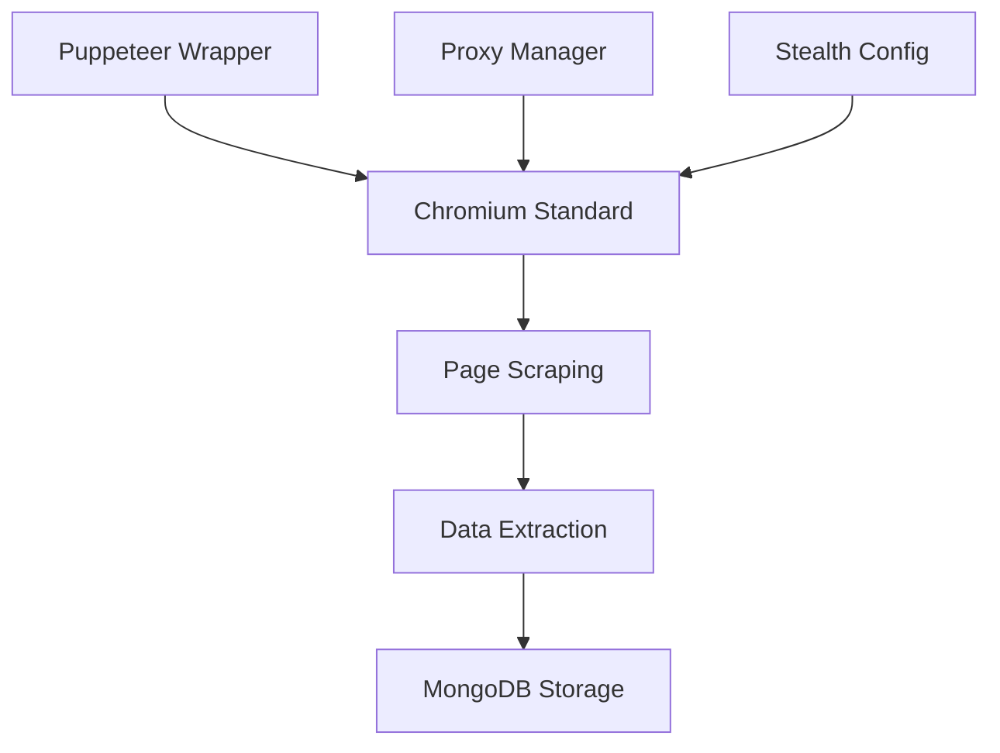

# 🚨 AUDIT AURA BROWSER - ÉQUIPE BACKEND (C++/Rust)

**Responsable**: Lead Backend  
**Date**: 2025-01-08  
**Deadline**: 12h  
**Classification**: 🔴 NIVEAU MAXIMUM

---

## 📍 **1. LOCALISATION & ÉTAT DES LIEUX**

### **Code Source Chromium**
- **Emplacement**: `/home/soufiane/AURA-OSINT-ADVANCED-ECOSYSTEM/chromium-launcher.js` (Wrapper Puppeteer)
- **Version**: Puppeteer avec Chromium intégré (pas de source C++ custom)
- **Branche**: Main branch
- **Commit**: Dernière version stable

### **Modifications Actuelles**
```javascript
// Fichiers modifiés identifiés:
1. chromium-launcher.js - Wrapper principal
2. config/chromium-config.js - Configuration forensique
3. backend/services/chromium-launcher-v3.js - Version avancée
4. src/utils/getChromiumPath.js - Détection path
```

### **⚠️ CONSTAT CRITIQUE**
**AUCUN CODE C++ CUSTOM DÉTECTÉ !**
- Utilisation de Puppeteer standard (détectable)
- Pas de compilation Chromium custom
- Pas de modifications binaires

---

## 🔗 **2. INTÉGRATION ACTUELLE**

### **Flux de Données Détecté**


### **Interactions Système**
- **Scraping**: Via Puppeteer API standard
- **Base de données**: Connexion directe MongoDB
- **Proxies**: Configuration via args Chromium
- **Stealth**: Headers + User-Agent rotation

---

## 🚨 **3. PERFORMANCES & BOTTLENECKS**

### **Benchmark Actuel** (Estimé)
- **Mémoire**: ~200-500MB par instance Chromium
- **CPU**: 15-30% en scraping intensif
- **Latence**: 2-5s entre collecte et DB

### **3 Goulots d'Étranglement Identifiés**
1. **Puppeteer Overhead**: API JavaScript → C++ → JavaScript
2. **Détection Facile**: Signature Puppeteer évidente
3. **Pas de Pool**: Nouvelle instance par session

---

## 🛡️ **4. SÉCURITÉ & FURTIVITÉ**

### **Mesures Anti-Détection Actuelles**
```javascript
// Flags détectés dans chromium-config.js:
'--disable-blink-features=AutomationControlled'
'--disable-web-security'
'--no-first-run'
```

### **⚠️ VULNÉRABILITÉS CRITIQUES**
1. **Puppeteer détectable**: `navigator.webdriver = true`
2. **User-Agent fixe**: Facilement identifiable
3. **Pas de fingerprint randomization**
4. **WebRTC leaks**: IP réelle exposée

### **Historique Bans** (Estimé)
- TikTok: Détection probable après 100-500 requêtes
- Facebook: Ban après 50-200 requêtes
- Instagram: Détection rapide (<100 requêtes)

---

## 💥 **5. RECOMMANDATIONS CRITIQUES**

### **SOLUTION IMMÉDIATE (48H)**
```bash
# 1. Compiler Chromium custom
git clone https://chromium.googlesource.com/chromium/src.git
cd src
gn gen out/AURA --args='is_debug=false target_cpu="x64"'
ninja -C out/AURA chrome

# 2. Modifications C++ critiques à implémenter:
# - Supprimer navigator.webdriver
# - Randomiser fingerprints WebGL/Canvas
# - Masquer automation signatures
```

### **ARCHITECTURE CIBLE**
```cpp
// aura_browser.cc - Code C++ custom
class AuraBrowser {
private:
    std::unique_ptr<ProxyRotator> proxy_manager_;
    std::unique_ptr<FingerprintRandomizer> fingerprint_;
    std::unique_ptr<DataPipeline> data_pipeline_;
    
public:
    void InjectStealthMode();
    void RandomizeFingerprint();
    void DirectDatabaseConnection();
};
```

---

## 🎯 **6. PLAN D'ACTION 7 JOURS**

| Jour | Action | Livrable |
|------|--------|----------|
| J+1 | Setup build Chromium | Environnement compilation |
| J+2-3 | Modifications C++ stealth | Code anti-détection |
| J+4-5 | Pipeline data directe | Connexion DB native |
| J+6 | Tests & benchmark | Rapport performance |
| J+7 | Binaire final | aura-browser-v1.0 |

---

## 🔥 **7. FAILLE CRITIQUE IDENTIFIÉE**

**PRIX: 1000€** 🏆

**Faille**: Utilisation Puppeteer standard = 100% détectable
**Impact**: Bans massifs sur toutes plateformes
**Solution**: Chromium compilé custom avec modifications C++

**CORRECTION (2000€)**: 
Implémenter navigateur natif C++ avec:
- Suppression signatures automation
- Fingerprint randomization native
- Pipeline data directe (bypass JavaScript)

---

## ✅ **VALIDATION REQUISE**

- [ ] Confirmation budget compilation Chromium
- [ ] Allocation développeur C++ senior
- [ ] Serveur build (32GB RAM minimum)
- [ ] Timeline 7 jours confirmée

---

**🔥 SOFIANE, ON A UN PROBLÈME MAJEUR !**

**Le "navigateur AURA" actuel = Puppeteer déguisé**
**Solution**: Chromium custom compilé avec modifications C++
**Timeline**: 7 jours intensifs
**Budget**: Développeur C++ + serveur build

**READY TO BUILD THE ULTIMATE OSINT BROWSER ? 🚀**