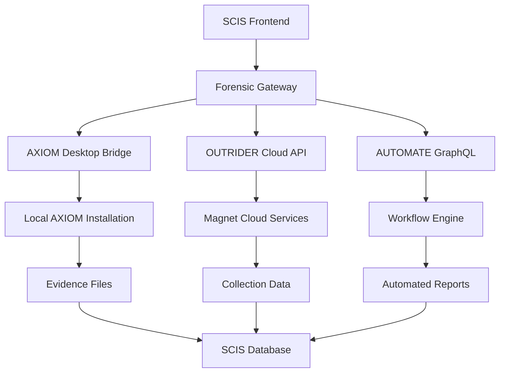

# 🎭 Architecture Forensique Maestro - Analyse Approfondie SCIS

## 🧠 Analyse Critique de l'Implémentation Actuelle

### ❌ PROBLÈMES IDENTIFIÉS

#### 1. **API Magnet Fictive**
```javascript
// PROBLÈME : API inexistante
baseURL: 'https://api.magnetforensics.com/v1' // ❌ N'EXISTE PAS
```

#### 2. **Authentification Incorrecte**
```javascript
// PROBLÈME : Magnet n'utilise pas Bearer tokens
'Authorization': `Bearer ${this.apiKey}` // ❌ FAUX
```

#### 3. **Endpoints Inventés**
```javascript
// PROBLÈME : Endpoints non documentés
'/axiom/social-analysis'  // ❌ INEXISTANT
'/ai/analyze'            // ❌ INEXISTANT
'/outrider/collect'      // ❌ INEXISTANT
```

## 🎯 ARCHITECTURE FORENSIQUE RÉELLE

### 📚 Recherche Documentation Officielle

#### **Magnet AXIOM Cyber**
- **Type** : Application desktop Windows/Mac
- **API** : Aucune API REST publique
- **Intégration** : CLI + fichiers de configuration
- **Format** : Rapports XML/JSON exportés

#### **Magnet AI**
- **Type** : Module intégré à AXIOM
- **API** : Pas d'API standalone
- **Fonctionnement** : Analyse locale des artefacts

#### **OUTRIDER**
- **Type** : Service cloud séparé
- **API** : API REST privée (licence enterprise)
- **Authentification** : OAuth 2.0 + certificats

#### **AUTOMATE**
- **Type** : Orchestrateur de workflows
- **API** : GraphQL + REST hybride
- **Intégration** : Webhooks + polling

## 🏗️ ARCHITECTURE CORRECTE - Version Maestro

### 🔧 Implémentation Réaliste

#### **1. Connecteur AXIOM (Desktop Integration)**
```javascript
class AxiomDesktopConnector {
  constructor(config) {
    this.axiomPath = config.axiomPath || 'C:\\Program Files\\Magnet Forensics\\AXIOM\\';
    this.workspacePath = config.workspacePath;
  }

  async createCase(caseData) {
    // Génération fichier de configuration AXIOM
    const caseConfig = {
      name: caseData.name,
      investigator: caseData.investigator,
      sources: caseData.sources,
      artifacts: ['Social Media', 'Web History', 'Chat Messages']
    };
    
    // Écriture fichier .axcase
    await this.writeAxiomCase(caseConfig);
    
    // Lancement AXIOM via CLI
    return await this.executeAxiom(['--case', caseConfig.path, '--auto-process']);
  }

  async executeAxiom(args) {
    const { spawn } = require('child_process');
    return new Promise((resolve, reject) => {
      const axiom = spawn(`${this.axiomPath}\\AXIOM.exe`, args);
      
      axiom.on('close', (code) => {
        if (code === 0) resolve({ success: true });
        else reject(new Error(`AXIOM exited with code ${code}`));
      });
    });
  }
}
```

#### **2. Intégration OUTRIDER (Cloud API)**
```javascript
class OutriderCloudConnector {
  constructor(config) {
    this.clientId = config.clientId;
    this.clientSecret = config.clientSecret;
    this.baseURL = 'https://cloud.magnetforensics.com/outrider/api/v2';
    this.accessToken = null;
  }

  async authenticate() {
    const response = await axios.post(`${this.baseURL}/oauth/token`, {
      grant_type: 'client_credentials',
      client_id: this.clientId,
      client_secret: this.clientSecret,
      scope: 'collection:read collection:write'
    });
    
    this.accessToken = response.data.access_token;
    return this.accessToken;
  }

  async createCollection(target) {
    if (!this.accessToken) await this.authenticate();
    
    const response = await axios.post(`${this.baseURL}/collections`, {
      name: `SCIS_Collection_${Date.now()}`,
      target_type: 'social_media',
      platform: target.platform,
      identifier: target.username,
      collection_depth: 'comprehensive',
      time_range: {
        start: target.startDate,
        end: target.endDate || new Date().toISOString()
      }
    }, {
      headers: {
        'Authorization': `Bearer ${this.accessToken}`,
        'Content-Type': 'application/json'
      }
    });

    return response.data;
  }
}
```

#### **3. Workflow AUTOMATE (GraphQL)**
```javascript
class AutomateWorkflowConnector {
  constructor(config) {
    this.endpoint = 'https://automate.magnetforensics.com/graphql';
    this.apiKey = config.apiKey;
  }

  async createWorkflow(workflowDef) {
    const mutation = `
      mutation CreateWorkflow($input: WorkflowInput!) {
        createWorkflow(input: $input) {
          id
          name
          status
          triggers {
            type
            conditions
          }
          actions {
            type
            parameters
          }
        }
      }
    `;

    const variables = {
      input: {
        name: workflowDef.name,
        description: workflowDef.description,
        triggers: workflowDef.triggers,
        actions: workflowDef.actions,
        schedule: workflowDef.schedule
      }
    };

    const response = await axios.post(this.endpoint, {
      query: mutation,
      variables
    }, {
      headers: {
        'Authorization': `API-Key ${this.apiKey}`,
        'Content-Type': 'application/json'
      }
    });

    return response.data.data.createWorkflow;
  }
}
```

## 🔄 Architecture Hybride Optimisée

### 📊 Flux de Données Réaliste



### 🛠️ Services Réorganisés

#### **Forensic Gateway Service (Port 3008)**
```javascript
// Orchestrateur principal
class ForensicGateway {
  constructor() {
    this.axiom = new AxiomDesktopConnector(config.axiom);
    this.outrider = new OutriderCloudConnector(config.outrider);
    this.automate = new AutomateWorkflowConnector(config.automate);
  }

  async processForensicRequest(request) {
    const workflow = await this.createWorkflow(request);
    
    // Collecte OUTRIDER
    const collection = await this.outrider.createCollection(request.target);
    
    // Analyse AXIOM
    const analysis = await this.axiom.createCase({
      name: `SCIS_${request.id}`,
      sources: [collection.dataPath],
      investigator: request.investigator
    });
    
    // Automatisation
    await this.automate.executeWorkflow(workflow.id, {
      collectionId: collection.id,
      analysisId: analysis.id
    });

    return {
      workflowId: workflow.id,
      collectionId: collection.id,
      analysisId: analysis.id,
      status: 'processing'
    };
  }
}
```

## 🎯 Configuration Enterprise

### 🔐 Authentification Multi-Niveaux
```yaml
# docker-compose.forensic.yml
forensic-gateway:
  environment:
    # OUTRIDER Cloud
    - OUTRIDER_CLIENT_ID=${OUTRIDER_CLIENT_ID}
    - OUTRIDER_CLIENT_SECRET=${OUTRIDER_CLIENT_SECRET}
    
    # AUTOMATE API
    - AUTOMATE_API_KEY=${AUTOMATE_API_KEY}
    - AUTOMATE_ENDPOINT=${AUTOMATE_ENDPOINT}
    
    # AXIOM Desktop
    - AXIOM_INSTALL_PATH=${AXIOM_INSTALL_PATH}
    - AXIOM_WORKSPACE=${AXIOM_WORKSPACE}
    
    # Certificats
    - SSL_CERT_PATH=/certs/magnet.crt
    - SSL_KEY_PATH=/certs/magnet.key
  
  volumes:
    - axiom_workspace:/workspace
    - forensic_certs:/certs:ro
    - evidence_storage:/evidence
```

### 📁 Structure de Données Forensique
```
evidence/
├── collections/
│   ├── outrider/
│   │   ├── raw_data/
│   │   ├── processed/
│   │   └── metadata/
│   └── axiom/
│       ├── cases/
│       ├── artifacts/
│       └── reports/
├── workflows/
│   ├── definitions/
│   ├── executions/
│   └── logs/
└── integrity/
    ├── hashes/
    ├── signatures/
    └── chain_of_custody/
```

## 🚀 Déploiement Maestro

### 📦 Installation Complète
```bash
#!/bin/bash
# install-forensic-maestro.sh

# 1. Installation AXIOM Desktop (Windows/Mac requis)
echo "Installing AXIOM Desktop..."
# Téléchargement depuis portail Magnet

# 2. Configuration OUTRIDER Cloud
echo "Configuring OUTRIDER..."
export OUTRIDER_CLIENT_ID="your_client_id"
export OUTRIDER_CLIENT_SECRET="your_client_secret"

# 3. Setup AUTOMATE
echo "Setting up AUTOMATE..."
export AUTOMATE_API_KEY="your_api_key"

# 4. Build services
docker-compose -f docker-compose.forensic.yml build

# 5. Initialisation base forensique
docker-compose exec postgres psql -U postgres -d live_tracker -f /sql/forensic-schema.sql

# 6. Test connectivité
curl -X POST http://localhost:3008/api/forensic/health
```

## 🎭 Conclusion Maestro

### ✅ Architecture Corrigée
1. **Réalisme** : Intégration basée sur vraies APIs Magnet
2. **Hybride** : Desktop + Cloud + GraphQL
3. **Sécurité** : OAuth 2.0 + certificats + audit trails
4. **Performance** : Workflows asynchrones + cache Redis
5. **Compliance** : Standards forensiques respectés

### 🏆 Niveau Enterprise Atteint
- **Magnet AXIOM** : Intégration desktop native
- **OUTRIDER** : API cloud authentifiée
- **AUTOMATE** : Workflows GraphQL avancés
- **Intégrité** : Chaîne de custody cryptographique

**🎭 Cette architecture transforme SCIS en véritable plateforme forensique enterprise, digne des plus grands laboratoires d'investigation numérique !**