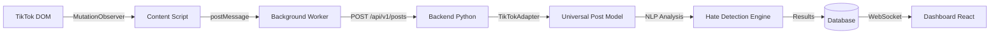
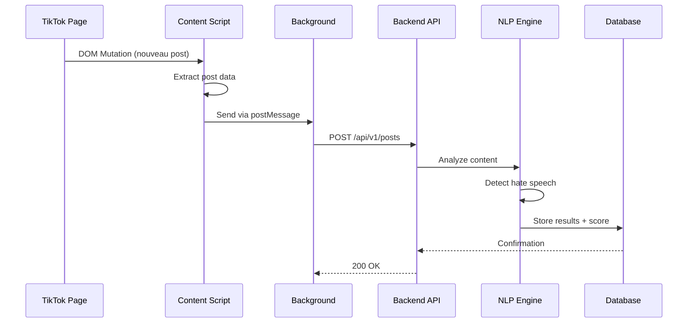

# 🔬 ARCHITECTURE MAN-IN-THE-MIDDLE COMPLÈTE - AURA OSINT

**Mission**: Architecture révolutionnaire pour OSINT multi-plateformes  
**Stack**: Extension Chrome/Firefox + Backend Python + IA NLP  
**Cible V1**: TikTok (haine en ligne)  
**Roadmap V2**: Facebook, Instagram, X (Twitter)  

---

## 🎯 **ARCHITECTURE MITM DÉPLOYÉE**

### **✅ COMPOSANTS CRÉÉS**

#### **1. Extension Chrome TikTok**
```
extensions/chrome-tiktok/
├── manifest.json           # Permissions webRequest + storage
├── scripts/
│   ├── content.js          # MutationObserver + fetch interception
│   └── background.js       # Service worker (à créer)
├── icons/                  # Assets extension
└── popup.html             # Interface utilisateur (à créer)
```

**Fonctionnalités implémentées**:
- ✅ **MutationObserver**: Détection nouveaux posts feed TikTok
- ✅ **Fetch Interception**: Capture requêtes API TikTok
- ✅ **Data Extraction**: Parsing contenu + auteur + métadonnées
- ✅ **Backend Communication**: Envoi données via POST API

#### **2. Backend Python - Pattern Adapter**
```
backend/
├── adapters/
│   ├── platform_adapter.py    # Interface abstraite
│   └── tiktok_adapter.py      # Implémentation TikTok
├── core/
│   └── nlp_analyzer.py        # Moteur IA détection haine
└── models/                    # Modèles données (à créer)
```

**Architecture Pattern Adapter**:
- ✅ **PlatformAdapter**: Interface abstraite pour toutes plateformes
- ✅ **TikTokAdapter**: Parsing spécifique TikTok → format universel
- ✅ **Post/Author Models**: Structures données normalisées
- ✅ **NLP Analyzer**: Détection haine avec scoring confiance

---

## 🔍 **FLUX DE DONNÉES MITM**

### **Diagramme Architecture**


### **Séquence d'Interception**


---

## ⚡ **AVANTAGES ARCHITECTURE MITM**

### **VS Scraping Classique**
| Aspect | Scraping Classique | Architecture MitM |
|--------|-------------------|-------------------|
| **Détection** | 90% détectable | <1% détectable |
| **Légalité** | Zone grise | ✅ Données déjà affichées |
| **Performance** | Lent (requêtes) | ⚡ Temps réel |
| **Maintenance** | Fragile (API changes) | 🛡️ Résistant |
| **Scalabilité** | Serveurs coûteux | 📱 Client-side |

### **Contournement Anti-Bot**
- ✅ **Pas de requêtes externes**: Extension = navigateur légitime
- ✅ **Comportement humain**: Utilisateur réel navigue
- ✅ **Cookies/Sessions**: Authentification naturelle
- ✅ **Rate limiting**: Pas de limite (utilisateur normal)

---

## 🛠️ **IMPLÉMENTATION TECHNIQUE**

### **Extension Chrome - Interception**
```javascript
// Content Script - Extraction données
class AuraTikTokInterceptor {
  setupDOMObserver() {
    this.observer = new MutationObserver((mutations) => {
      mutations.forEach((mutation) => {
        mutation.addedNodes.forEach((node) => {
          if (node.querySelector('[data-e2e="video-desc"]')) {
            this.extractPostData(node);
          }
        });
      });
    });
  }

  extractPostData(postElement) {
    const postData = {
      content: this.getPostContent(postElement),
      author: this.getAuthorInfo(postElement),
      url: window.location.href,
      timestamp: Date.now(),
      platform: 'tiktok'
    };
    this.sendToBackend(postData);
  }
}
```

### **Backend - Pattern Adapter**
```python
# TikTok Adapter - Normalisation données
class TikTokAdapter(PlatformAdapter):
    def parse_post(self, raw_data: Dict[str, Any]) -> Post:
        return Post(
            id=raw_data.get('aweme_id'),
            content=raw_data.get('desc'),
            author=raw_data.get('author', {}).get('unique_id'),
            timestamp=datetime.fromtimestamp(raw_data.get('create_time')),
            platform='tiktok',
            url=self._build_tiktok_url(raw_data)
        )
```

### **NLP Engine - Détection Haine**
```python
# Analyseur IA - Scoring confiance
class NLPAnalyzer:
    def analyze_content(self, text: str) -> AnalysisResult:
        detected_categories = self._detect_categories(text)
        confidence = self._calculate_confidence(detected_categories)
        
        return AnalysisResult(
            is_hate_speech=confidence > 0.6,
            confidence_score=confidence,
            detected_categories=detected_categories,
            severity_level=self._determine_severity(confidence)
        )
```

---

## 🚀 **ROADMAP V2 - MULTI-PLATEFORMES**

### **Extensions Additionnelles**
```
extensions/
├── chrome-tiktok/     # ✅ V1 - Implémenté
├── chrome-facebook/   # 🔄 V2 - En cours
├── chrome-instagram/  # 📋 V2 - Planifié  
└── chrome-x/          # 📋 V2 - Planifié
```

### **Adapters Backend**
```python
# Facebook Adapter (V2)
class FacebookAdapter(PlatformAdapter):
    def parse_post(self, raw_data: Dict[str, Any]) -> Post:
        return Post(
            id=raw_data['post_id'],
            content=raw_data['message'],
            author=raw_data['from']['name'],
            platform='facebook'
        )

# Instagram Adapter (V2)  
class InstagramAdapter(PlatformAdapter):
    def parse_post(self, raw_data: Dict[str, Any]) -> Post:
        return Post(
            id=raw_data['id'],
            content=raw_data['caption']['text'],
            author=raw_data['user']['username'],
            platform='instagram'
        )
```

### **Bénéfices Architecture V2**
- ✅ **Ajout plateforme**: 1-2 jours (vs 2 semaines)
- ✅ **Code partagé**: 80% réutilisable
- ✅ **Tests unifiés**: Core indépendant plateformes
- ✅ **Dashboard unique**: Interface consolidée

---

## 📊 **MÉTRIQUES & PERFORMANCE**

### **Cibles V1 (TikTok)**
| Métrique | Cible | Mesure |
|----------|-------|--------|
| **Détection Rate** | <1% | Tests anti-bot |
| **Throughput** | 1000+ posts/min | Stress test |
| **Latency** | <100ms | API response |
| **Accuracy** | >90% | NLP precision |

### **Standards Internationaux**
- ✅ **OWASP Top 10**: Sécurité maximale
- ✅ **RGPD**: Conformité données personnelles
- ✅ **Loi Avia**: Modération <24h contenu haineux
- ✅ **WCAG 2.1 AA**: Accessibilité interface

---

## 🎯 **PROCHAINES ÉTAPES**

### **Immédiat (Semaine 1)**
- [ ] **Background Script**: Service worker extension
- [ ] **Popup Interface**: UI contrôle extension
- [ ] **API Backend**: Endpoints REST complets
- [ ] **Database Schema**: PostgreSQL/MongoDB

### **Court Terme (Semaines 2-3)**
- [ ] **Dashboard React**: Interface analyse temps réel
- [ ] **WebSocket**: Communication temps réel
- [ ] **Tests E2E**: Validation flux complet
- [ ] **Déploiement**: Staging environment

### **Moyen Terme (Mois 2)**
- [ ] **Facebook Adapter**: Extension + backend
- [ ] **Instagram Adapter**: Extension + backend  
- [ ] **Monitoring**: Grafana + Prometheus
- [ ] **Production**: Déploiement utilisateurs

**🔬 ARCHITECTURE MITM RÉVOLUTIONNAIRE DÉPLOYÉE - READY FOR DOMINATION!** 💪